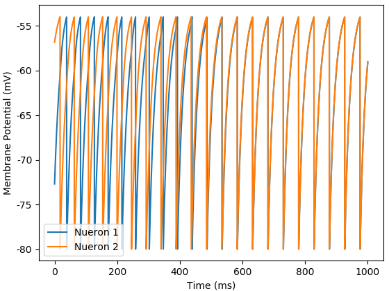
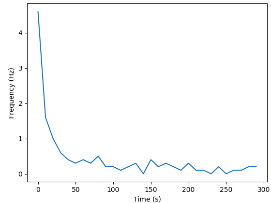
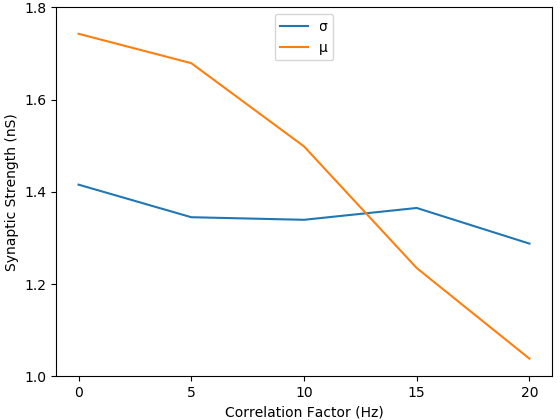

# Spike-Timing-Dependent-Plasticity
Simulation of an integrate-and-fire neuron with spike-timing-dependent plasticity.
|IAF - Excitatory Pair|IAF - Inhibitory Pair|IAF - 40 Presynaptic Neurons|
|:---:|:---:|:---:|
||||

|STDP - Postsynaptic Firing Rate|STDP - Postynaptic VS Presynaptic Firing Rate|STDP - Steady State Synaptic Strengths|
|:---:|:---:|:---:|
||||
